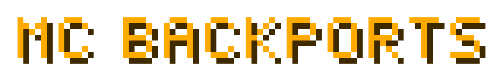

<p align="center">
  
</p>

<p align="center">
  Resource packs written for new Minecraft versions, made to run on old ones.<br>
  <a href="https://github.com/jimbobjunior1234567891011-crypto/mc-backports/issues/new?template=backport-request.yml"><b>Request a backport</b></a>
</p>

---

Modern resource packs stop working on older versions for reasons that have nothing to do with the textures. The item model system was rewritten in 1.21.4, and the rules for model geometry loosened again in 1.21.6 and 1.21.11. A pack built against any of that doesn't degrade gracefully on 1.21.1 — it does nothing at all, or it refuses to load.

This repo backports them anyway: a converter that rewrites the pack, and a small client mod that draws the parts the old version genuinely cannot.

## Backports

| pack | from | to | coverage |
|---|---|---|---|
| [Weskerson's 3D Items](https://modrinth.com/resourcepack/tools-and-utils) 2.5 | 1.21.4+ | 1.21.1 NeoForge | **336 / 338** items, eating frames, use-key poses, compass and clock |

Converted packs are **not** distributed here — they're someone else's art. The converter runs against your own copy of the pack.

## Request a backport

[Open a request.](https://github.com/jimbobjunior1234567891011-crypto/mc-backports/issues/new?template=backport-request.yml) Say which pack, which version, and which parts matter most to you. NeoForge targets get the best results, because the converter leans on model features only NeoForge has.

Some things can't be backported at all, and the issue will say so plainly rather than going quiet — an item that doesn't exist in the target version has nothing to render.

## Why packs break

Two independent problems, and most "just change the pack_format" advice fixes neither.

**1. The item definition layer.** Since 1.21.4 an item's model is chosen by a JSON file in `assets/minecraft/items/` that can branch on display context, item components and use state. Older versions don't read that directory — they map item id straight to `models/item/<id>.json`. Every item silently stays vanilla.

**2. The geometry.** Element rotation rules loosened twice:

| | multiple axes at once | angles off the 22.5° grid |
|---|---|---|
| 1.21.1 | no | no |
| 1.21.6 | no | yes |
| 1.21.11 | yes | yes |

Weskerson's 2.5 uses 1473 multi-axis elements and 924 free-angle ones. 1.21.1 rejects those models outright — not a visual glitch, a load failure.

## How the conversion works

**Item definitions → plain models.** Each definition is flattened into `models/item/<id>.json`.

**2D in the inventory, 3D in the hand** survives via NeoForge's `neoforge:separate_transforms`: the `gui`/`ground`/`fixed` perspectives get the vanilla model, the hand perspectives get the pack's 3D models.

**Geometry, three tiers:**

| tier | what happens | models |
|---|---|---|
| legal as-is | copied unchanged | 467 |
| rotation is 90/180/270 plus a legal remainder | the right-angle part is applied to the box's own coordinates, the remainder stays in the rotation field | 26 |
| anything else | emitted as a `freerot:mesh` quad soup with the rotation already applied — needs the mod | 393 |

The right-angle bake is exact, and proven so: every rewritten face is compared against the textured quad the original element produced, and a model is only rewritten when all of them match.

**Item states → overrides.** States the old version has no property for are rebuilt as ordinary `overrides` driven by properties the mod registers — one generated model per reachable state, ordered so Minecraft's "last matching override wins" picks the right one.

| pack asks for | 1.21.1 gets |
|---|---|
| `minecraft:use_duration` (remaining) | `freerot:use_ticks` + `freerot:using` → eating and drinking frames |
| `minecraft:keybind_down` (`key.use`) | `freerot:use_key` → flint & steel / shears strike pose |
| `minecraft:has_component` (enchantments) | `freerot:enchanted` |
| `minecraft:fishing_rod/cast` | vanilla `cast` |
| `minecraft:compass` / `minecraft:time` | vanilla `angle` / `time`, rescaled from the dispatch's own `scale` |

## FreeRot, the mod

Client-only, NeoForge 21.1.x, about 200 lines. No config, no commands, no registry objects. Without a pack asking for it, it does nothing.

- **`freerot:mesh` model loader** — takes pre-transformed quads and bakes them. The converter applies rotations up front, so the game never sees a rotation it would refuse.
- **four item properties** — `freerot:use_key`, `freerot:using`, `freerot:use_ticks`, `freerot:enchanted`.

### Getting the rotation math right

The converter reproduces the game's own transform rather than approximating it:

- single axis → `Matrix4f.rotation(angle, axis)`
- several axes → `Matrix4f.rotationZYX(z, y, x)`, i.e. **X first, then Y, then Z**
- `rescale` → `1 / max(|component|)` of each axis under the rotation, applied *before* it (this generalises the familiar `sqrt(2)` for a 45° turn)

That composition order was read out of the 1.21.11 client jar (`hqd$a`), not guessed. The vertex and UV mapping mirrors `FaceBakery` via [deepslate](https://github.com/misode/deepslate)'s reimplementation.

## Layout

```
converter/
  backport.py        pack -> old-version pack, mode "plain" or "mod"
  bake.py            right-angle bake + the FaceBakery-equivalent quad mapping
  mesh.py            arbitrary rotations -> freerot:mesh quad soup
  fix_hotbar.py      repairs an out-of-range animation frame list
  tests/
    test_bake.py     baked models must emit the original's quads
    test_mesh.py     mesh output cross-checked against the verified mapping
    validate.py      references, cycles, rotation legality, loader shapes
mod/
  src/               FreeRot
  build.ps1          javac + jar, no Gradle
tools/               analysis: angle census, per-item blockers, bake feasibility
```

## Usage

```bash
python converter/backport.py <unpacked-pack> <out-dir> <path-to-1.21.1.jar> mod
python converter/tests/validate.py <out-dir> <path-to-1.21.1.jar>
```

Use `plain` instead of `mod` for a build that needs no mod (fewer items, no animated states). Run both tests after any change to `bake.py` or `mesh.py`:

```bash
python converter/tests/test_bake.py <unpacked-pack>
python converter/tests/test_mesh.py <unpacked-pack>
```

Building the mod — it compiles against the jars a NeoForge install already has, so there's no Gradle and nothing to download:

```powershell
powershell -ExecutionPolicy Bypass -File mod\build.ps1
```

## Status

In use and working in game on a 1.21.1 NeoForge Create pack.

Two bugs only a launch could find, both fixed and both now covered by the validator or the code:

- Inlining vanilla's override chain reproduced its self-referencing first entry (`item/compass` → `item/compass`), which recursed until the resource reload died with a `StackOverflowError` — and Minecraft's response to a failed reload is to disable *every* enabled pack, which makes it look like a broken zip.
- A sparse culled-face map handed `ItemRenderer` a null quad list, because `SimpleBakedModel.getQuads` does a bare `culledFaces.get(side)` with no fallback. Vanilla's own builder pre-fills all six directions.

Static validation caught neither. It now checks for reference cycles, but the lesson stands: only launching the game exercises the render path.

## Not covered

- Items that don't exist in the target version (in Weskerson's case 72 of them: copper lanterns, harnesses, coloured bundles, nautilus armor, pale oak boats and signs, newer spawn eggs and discs).
- Models a pack references but doesn't ship — 2.5 does this for two hanging signs.
- A state change swaps the whole model, so an item mid-eat also shows its chew stage in the inventory slot for those few ticks.

## Credits

Weskerson's 3D Items is by [weskerson](https://modrinth.com/user/weskerson). This repo doesn't include or redistribute it; it converts your own copy. If you share a converted pack, that's the original author's call, not this repo's.
